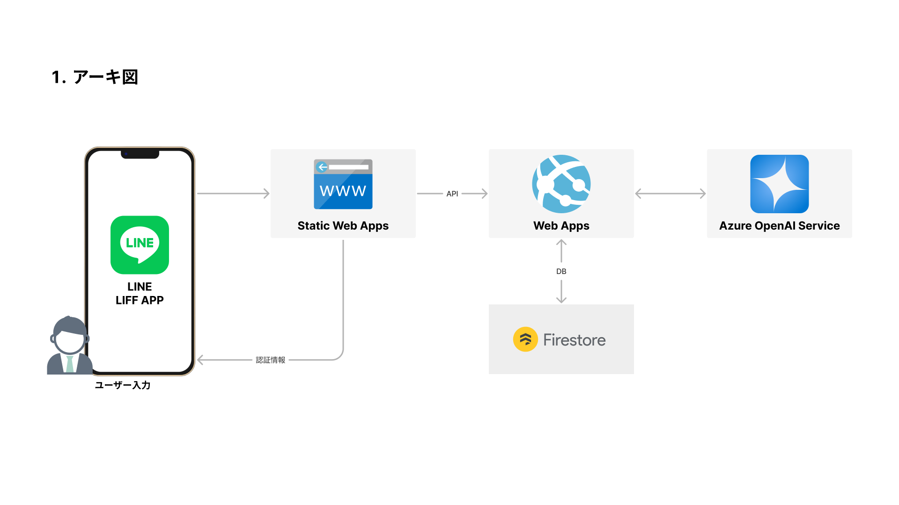

# 2024 LINE LIFFアプリ　フロントエンド

## [ブログ記事：LINE×生成AI：チャットバトルゲームを作る！](https://tech-lab.sios.jp/archives/43089)


## 紹介

アプリケーションの紹介です。詳細は[こちらのブログ](https://tech-lab.sios.jp/archives/43089)を読んでもらえるとうれしいです。

### ゲームコンセプト

生成AIを使ってキャラクター同士を戦わせる公式LINEです。


### アーキテクト図

構成としてはAzureでの実装に寄っています。



データベースにFirestoreを使用しています。こちらは無料枠が結構あるので、小さなアプリケーションには最適です。

- [フロントエンド](https://github.com/Ryunosuke-Tanaka-sti/2024-line-liff-app-frontend)
- [バックエンド](https://github.com/Ryunosuke-Tanaka-sti/2024-line-liff-app-backend)

### 使用ライブラリ

詳細は、package.jsonをご覧ください。

## リポジトリについて

詳細については、問い合わせいただけると助かります。興味があればいつでも連絡待ってます( *´艸｀)

### ディレクトリ構造

全体のディレクトリ構造としては以下の様な構造になっています。

```txt
├─api                   # API処理
│  ├─Battle
│  ├─Enemy
│  └─User
├─assets                # 静的ファイル
├─components            # コンポーネント
│  ├─common
│  └─modules
├─hooks                 # Hooks
├─pages                 # 各ページ
│  └─layouts
├─router                # react-router定義（SPAのパス構造）
├─types                 # タイプ定義
└─utilities             # 汎用処理まとめ
```

### 起動方法

```bash

yarn install

cp .env.sample .env
# .env内の内容を自分の環境に書き換えてください

yarn dev

```

http://localhost:5173/ にアクセスしてもらえれば起動すると思います。

起動しても、LINE内ブラウザからの起動出なければアプリの実行を行うことができません。なので、ソースの参考レベルに使用してね！
